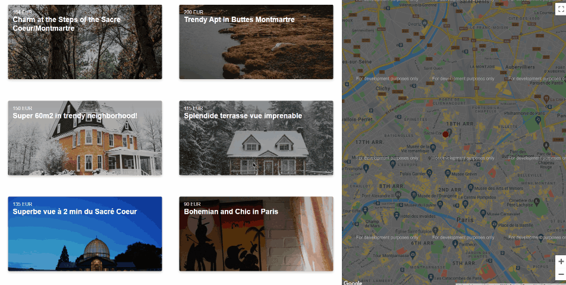

### Flat Finder App

The goal of this challenge was to create a React app that could display the location of a selected flat on a Google-React-Map.

Here's how it looks:

#### 1. Setup

The challenge used the Le Wagon [React boilerplate](https://github.com/lewagon/react-boilerplate):

#### 2. Features

1. When a user selects a flat, a marker will be placed on the map at the location of the flat.

#### 3. Potential Features

1. Display a marker for each flat on the map, and allow users to select a flat based on its marker, or vice versa.
